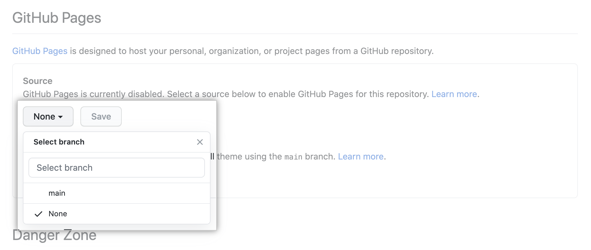

# GitHub pages

---

## 什么是GitHub Pages？

GitHub Pages是一个静态站点服务，可以直接展示github仓库中的静态文件即HTML、CSS、JavaScript文件。静态文件的产生，提供了可选的自动打包。

站点的域名默认为`github.io`，也可以自定义域名。

---

## GitHub Pages站点类型

有三种类型的GitHub Pages站点：项目级、用户级以及组织级。项目级与github上的特定项目相关联，用户以及组织级和特定账号相关联。

发布用户级站点，必须创建一个名为`<username>.github.io`的仓库，`<username>`为你对应的github用户名。发布组织级站点，必须创建一个名为`<organization>.github.io`，`<organization>`为你对应的github用户名。除非你自定义了域名，用户级站点和组织级站点可以通过以下对应的网址进行访问`http(s)://<username>.github.io`和`http(s)://<organization>.github.io`。

项目级站点的源文件和该项目存储在同一个仓库下。在没有自定义域名时，可以`http(s)://<username>.github.io/<repository>`或`http(s)://<organization>.github.io/<repository>`

如果你私下发布你的网站，你的网站的网址会有所不同。

> **自定义域名**

需要你自己现有一个域名，然后在仓库设置中进行设置。

---

## GitHub Pages站点的发布源

GitHub Pages站点的发布源为分支中对应文件夹存储的源文件。

> **默认发布源**

如果仓库存在默认发布源，GitHub Pages会自动将该发布源发布为站点。

**用户和组织站点：**

用户和组织站点的默认发布源是存储库默认分支的根目录(`/(root)`)。

**项目站点：**

**项目站点**的默认发布源为`gh-pages`分支的根目录（`/(root)`）。

> **修改发布源**

你也可以修改默认行为，将任意分支的根目录（`/(root)`）或`/docs`目录作为发布源。

具体操作为：

1. 进入仓库的设置界面：点击仓库名称，然后点击Settings。

2. 找到对应的`GitHub Pages`设置，选择对应的分支以及文件夹，保存即可。

如果你将任何分支的`/docs`目录作为发布源， GitHub Pages会读取`/docs`目录下的所有内容（包括CNAM文件），并将其发布成站点。

实际操作时，在根目录下创建`docs`目录，并将站点源码存放在该目录，推送到远程仓库即可。

---

## 静态站点生成器

GitHub Pages会将发布源中的静态文件发布成站点即网站。这些静态文件你可以自己生成，并推送到发布源对应的分支。也可以使用GitHub提供的**静态站点生成器**自动生成。

Github 默认使用`Jekyll`来自动打包。如果需要关闭自动打包，可以在发布源根目录下创建一个空的`.nojekyll`文件即可。

> **自动打包配置**

---

## Github Pages使用指南

> **使用限制**

GitHub Pages的站点有以下限制：

+ GitHub页面源存储库的建议限制为1GB。
+ 已发布的GitHub页面站点不能大于1 GB
+ GitHub页面站点的带宽限制为每月100GB
+ GitHub页面站点每小时不超过10个构建的限制

## 参考

+ [en-GitHub Docs-Getting started with GitHub Pages
](https://docs.github.com/en/github/working-with-github-pages/getting-started-with-github-pages)
